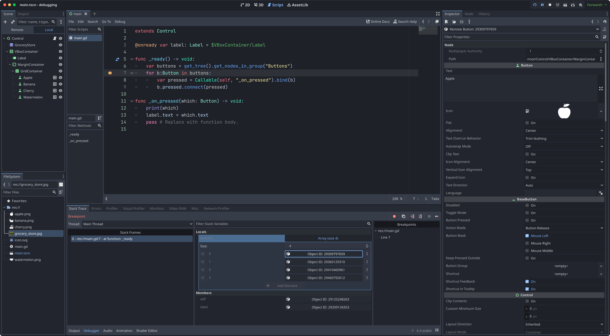
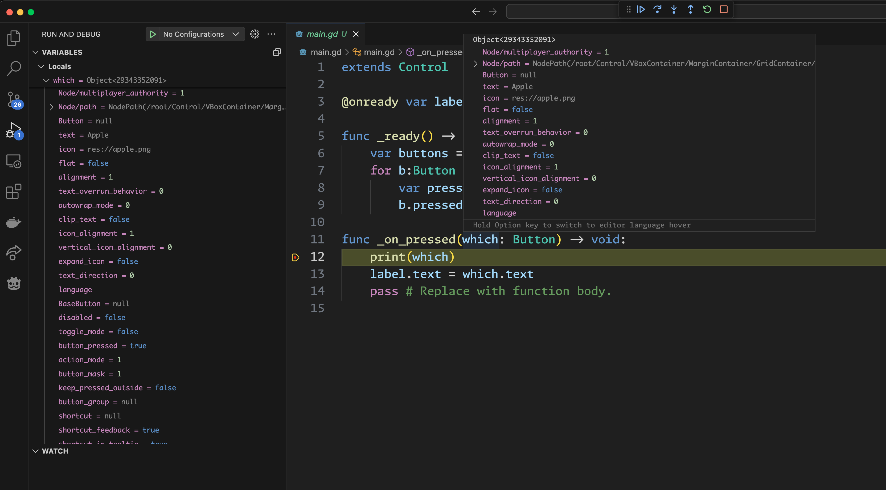
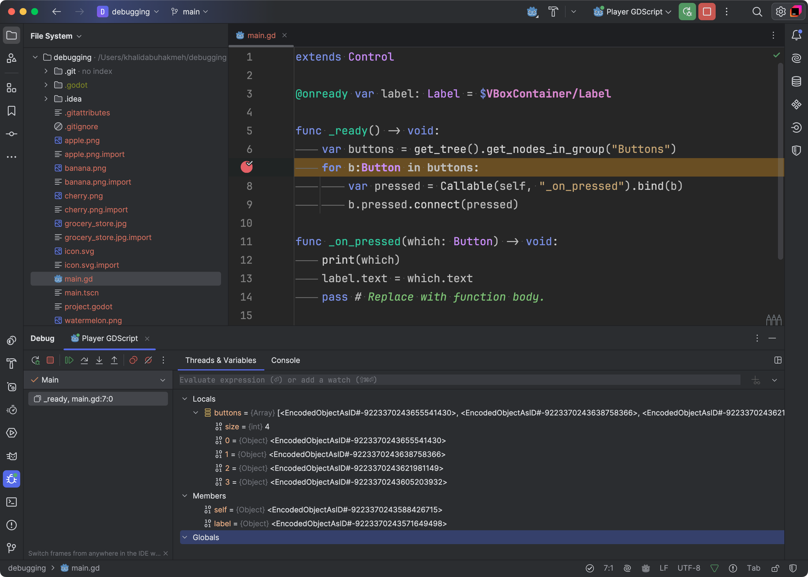

# Debugging Experience

This project shows the current debugging experience differences between Godot Engine editor, JetBrains Rider, and VS Code.

To try it out yourself, set a breakpoint in `main.gd` either in `_ready` or `_on_pressed`.

## Godot Engine

The debugger shows "links" that refresh the inspector with the current node, and it's field values. This is the most robust debugging experience as you have access to all the inspector options and can change them in real-time.

## VS Code

This shows the use of `godot-tools` debugging experience. There is a strange issue where debugging doesn't work in `_ready`, but other breakpoints will show the node and it's property values. It will also display any children values.

## JetBrains Rider

This shows the debugger experience in JetBrains is limited to local variables, and only shows the Object Identifier. You cannot expand or see values that you would expect to find in the Godot Inspector.

This makes it difficult to use JetBrains Rider for debugging anything other than local values or pure script experiences.

